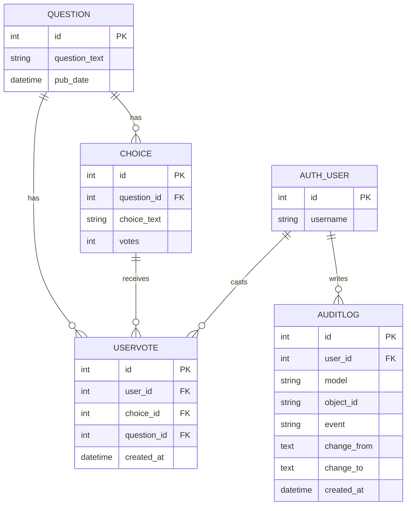
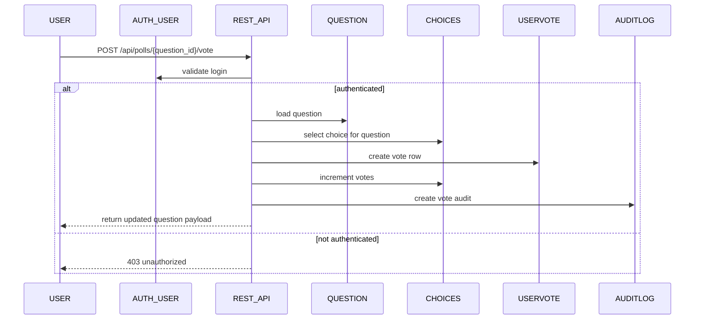
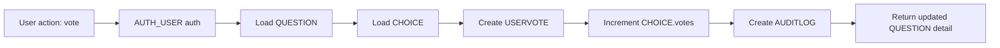
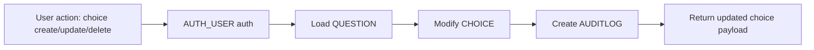
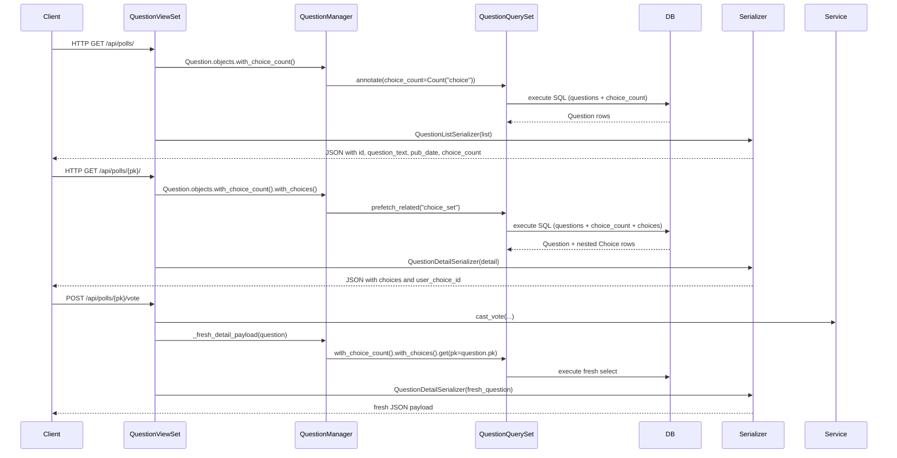
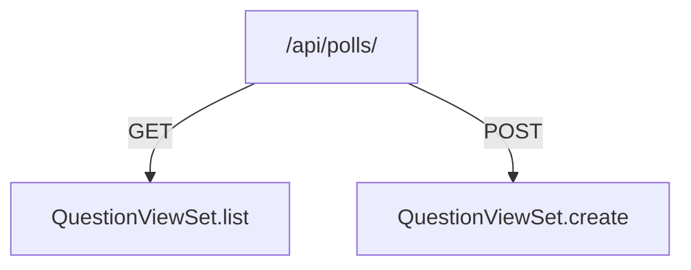
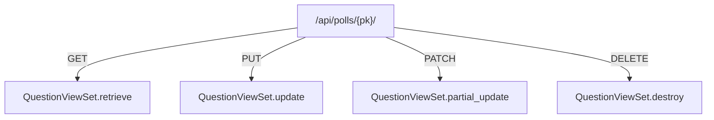
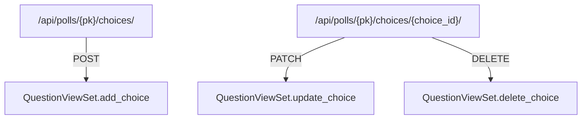
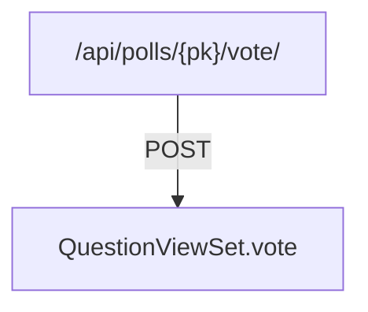
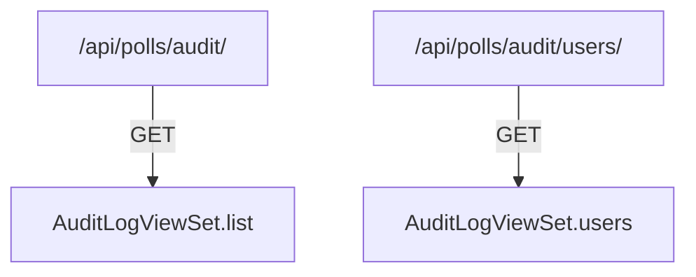

> Django Technical Assessment - LogBook Diagrams

# Diagrams

## Mermaid :: ER Diagram for polls + auth_user Models

## Mermaid :: Dataflow Diagrams for polls + auth_user Models

### 1) Vote flow sequence

### 2) Vote flowchart

### 3) Choice create/update/delete flowchart

## Mermaid :: DRF dataflow diagram (QuestionView)

> Explanation

- QuestionViewSet.get_queryset() uses QuestionManager.with_choice_count() so every query returns choice_count via annotation.
- For retrieve/vote, it adds with_choices() so nested Choice rows are prefetched.
- get_serializer_class() selects QuestionListSerializer for list views and QuestionDetailSerializer for detail/vote views.
- _fresh_detail_payload() re-fetches the detail queryset with the same annotated manager methods to ensure the response includes the latest choice counts and nested choices.

## API URL map for DRF

Base path: `/api/polls/`

### Question endpoints

- `GET /api/polls/`
  - `QuestionViewSet.list`
- `POST /api/polls/`
  - `QuestionViewSet.create`
- `GET /api/polls/{pk}/`
  - `QuestionViewSet.retrieve`
- `PUT /api/polls/{pk}/`
  - `QuestionViewSet.update`
- `PATCH /api/polls/{pk}/`
  - `QuestionViewSet.partial_update`
- `DELETE /api/polls/{pk}/`
  - `QuestionViewSet.destroy`

### Question custom actions

- `POST /api/polls/{pk}/vote/`
  - `QuestionViewSet.vote`
- `POST /api/polls/{pk}/choices/`
  - `QuestionViewSet.add_choice`
- `PATCH /api/polls/{pk}/choices/{choice_id}/`
  - `QuestionViewSet.update_choice`
- `DELETE /api/polls/{pk}/choices/{choice_id}/`
  - `QuestionViewSet.delete_choice`

### Audit endpoints

- `GET /api/polls/audit/`
  - `AuditLogViewSet.list`
- `GET /api/polls/audit/users/`
  - `AuditLogViewSet.users`

---

## Mermaid diagram

--

--

--

--

That covers the complete DRF router surface defined by api_urls.py and the viewset actions in `QuestionViewSet` / `AuditLogViewSet`.
